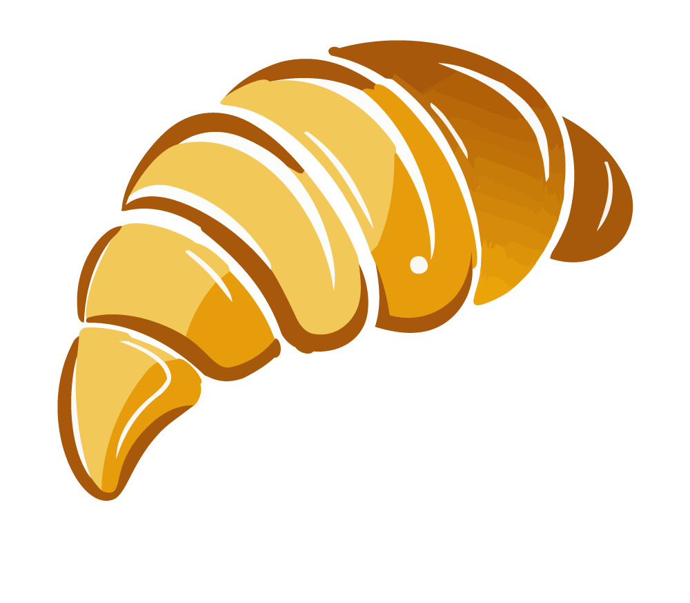

> \[!WARNING\]  
> This project is a work in progress and should not be considered production-ready.

  

  <em>
     A C++ TUI framework inspired by
    <a href="https://docs.python.org/3/library/tkinter.html">tkinter</a>,
    easy to learn, fast to code, beginner friendly.
  </em>

  

  

  

  

---

Resources
-
<ul>
  <li>
    <strong>Documentation:</strong>
    
  </li>

  <li>
    <strong>Source:</strong>
    <a href="https://github.com/Aintdev/CroissanTUI">https://github.com/Aintdev/CroissanTUI</a>
  </li>
</ul>

---

TODO: Create readme.md :)
